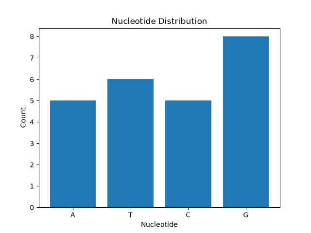

# BioSeq Analyzer

**[English](README.md) | 中文**

一个以 **Learning by Building，在项目中学** 为核心思路的生物信息学 Python 入门项目。

BioSeq Analyzer 面向刚开始接触“生信相关 Python 编程”的学习者。与分别学习 Python 语法、第三方库和生物信息学数据处理不同，本项目希望通过完成一个可以实际运行的小型生物序列分析工具，让学习者在解决具体问题的过程中逐步理解相关知识。

通过这个项目，你可以接触和学习：

* Python 基础语法和编程思想
* 生物信息学常用 Python 库
* 基础生物序列数据处理方式
* FASTA 文件处理
* 数据可视化
* 异常处理
* 模块化编程与基础工程化思想

## 功能

BioSeq Analyzer 目前支持：

* 读取 FASTA 格式的 DNA 序列
* 检查 DNA 序列是否合法
* 计算序列长度
* 统计 A/T/C/G 四种碱基数量
* 计算 GC 含量
* 生成 DNA 反向互补序列
* DNA 转录为 RNA
* RNA 翻译为蛋白质
* 对碱基组成进行可视化
* 将分析图自动保存为图片

## 学习目标

这个项目并不是为了替代成熟的专业生物信息学软件。

它的主要目标是提供一个简单、完整、能够实际运行的项目，让初学者理解：

> Python 是怎样一步一步处理真实生物序列数据的。

### Python 基础

项目会涉及常见的 Python 基础知识：

* 变量
* 函数
* 条件判断
* 循环
* 字符串
* 字典
* 集合
* 模块
* 异常处理

### Biopython

通过项目学习 **Biopython** 的基础使用，包括：

* 使用 `SeqIO` 读取 FASTA
* 使用 `Seq` 表示生物序列
* DNA 转录
* 蛋白质翻译

### 生物序列数据处理

项目涉及以下基础生物信息学处理：

* DNA 序列合法性检查
* 碱基组成统计
* GC 含量计算
* 反向互补序列
* DNA → RNA → Protein

### 数据可视化

使用 **Matplotlib** 将碱基组成转化为简单的统计图，并将结果保存为图片。

### 基础工程化思想

除了完成生物信息学功能，本项目还会接触：

* Python 虚拟环境
* Python 模块化
* `main()` 主程序结构
* 依赖管理
* 异常处理
* Git 版本控制

## 项目结构

```text
BioSeq-Analyzer/
│
├── main.py
├── analyzer.py
├── README.md
├── README.zh-CN.md
├── requirements.txt
├── .gitignore
│
├── data/
│   └── example.fasta
│
└── results/
    └── nucleotide_distribution.png
```

### `main.py`

负责控制程序整体流程：

```text
读取 FASTA
    ↓
检查序列
    ↓
基础序列分析
    ↓
DNA → RNA → Protein
    ↓
生成可视化结果
```

### `analyzer.py`

保存使用 Python 实现的基础序列处理功能：

* DNA 序列合法性检查
* 碱基数量统计
* GC 含量计算
* 反向互补序列生成

### `data/`

存放程序需要读取的 FASTA 文件。

### `results/`

保存程序生成的分析图片。

## 环境要求

推荐环境：

* Python 3.13
* Biopython
* Matplotlib

安装项目所需依赖：

```bash
python -m pip install -r requirements.txt
```

## 安装

克隆仓库：

```bash
git clone https://github.com/hcwwuu/BioSeq-Analyzer.git
```

进入项目目录：

```bash
cd BioSeq-Analyzer
```

创建虚拟环境：

```bash
python -m venv .venv
```

Windows PowerShell 中激活虚拟环境：

```powershell
.\.venv\Scripts\Activate.ps1
```

安装依赖：

```bash
python -m pip install -r requirements.txt
```

## 使用方法

将需要分析的 DNA 序列以 FASTA 格式放入 `data/` 文件夹。

例如：

```text
>example_sequence
ATGGCCATTGTAATGGGCCGCTGA
```

运行程序：

```bash
python main.py
```

程序会输出：

```text
Length: ...
Base Counts: ...
GC Content: ... %
Reverse Complement: ...
DNA: ...
RNA: ...
Protein: ...
```

同时生成碱基组成统计图：

```text
results/nucleotide_distribution.png
```

## 示例结果



## 程序流程

```text
FASTA 文件
    ↓
Biopython SeqIO
    ↓
DNA 序列
    ↓
序列合法性检查
    ↓
基础序列分析
    ├── 碱基数量
    ├── GC 含量
    └── 反向互补序列
    ↓
Biopython Seq
    ↓
转录
    ↓
RNA
    ↓
翻译
    ↓
Protein
    ↓
Matplotlib 可视化
```

## 为什么做这个项目？

对于初学者来说，如果分别学习 Python 语法、生物学概念、第三方库和各种生信数据格式，很容易出现“每一个知识点都学过，但不知道如何组合起来解决一个实际问题”的情况。

BioSeq Analyzer 采用 **Learning by Building，在项目中学** 的方式。

学习者不是先完整学习所有知识再开始项目，而是在逐步构建一个完整的生物序列分析流程时，根据实际需求学习对应的 Python 语法、库和生物信息学知识。

基础版本刻意控制了项目复杂度，希望学习者能够完整理解：

```text
数据从哪里来
→ Python 如何读取
→ 如何进行处理
→ 如何得到生物学结果
→ 如何进行可视化
→ 如何组织成一个完整项目
```

在理解这一完整流程之后，再进一步学习更复杂的生物信息学分析会更加自然。

## 后续可扩展方向

项目后续可以继续加入：

* 多序列 FASTA 处理
* ORF 开放阅读框识别
* Motif 序列模式搜索
* NCBI 序列自动获取
* BLAST 序列比对
* 更多序列统计指标
* 命令行参数
* 更多数据可视化方式

这些功能暂时不加入基础版本，是为了让项目保持简单、容易理解，适合作为生信 Python 的第一个完整项目。

## 使用技术

* Python
* Biopython
* Matplotlib
* Git
* GitHub
